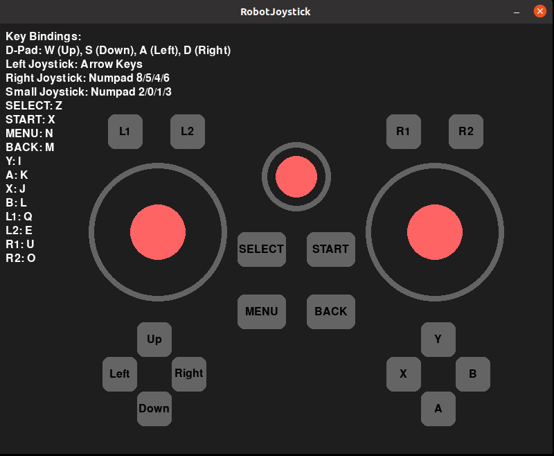

# 英文 | [中文](README_cn.md)
# robot-joystick

## 1. Download and Run

- Open a Bash terminal.

- Download the robot-joystick：

  ```
  git clone https://github.com/limxdynamics/robot-joystick.git
  ```

- Run the robot-joystick：

  ```
  ./robot-joystick/robot-joystick
  ```

## 2. Demonstration of Results

